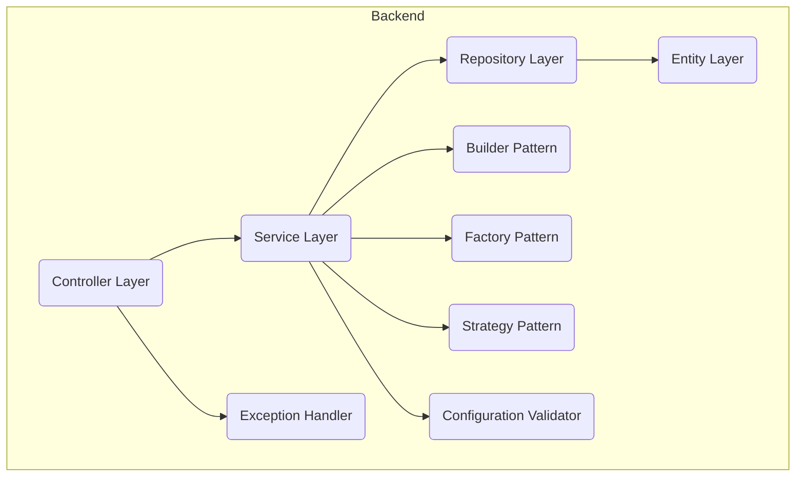
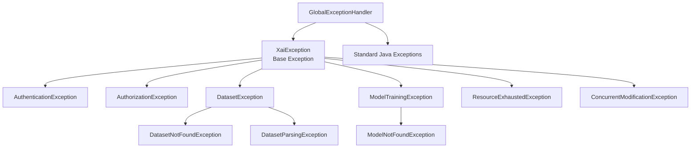

# XAI-Forge: System Architecture

This document provides a detailed breakdown of the XAI-Forge system architecture, covering high-level components, low-level backend design, and data flows.

**(Note: To view the diagrams below, use a Markdown previewer with Mermaid.js support, such as the one in VS Code or GitHub.)**

### 1. High-Level Architecture

The system follows a classic **three-tier architecture**, which separates the presentation, logic, and data layers. This is a robust and scalable pattern for modern web applications.

#### High-Level Diagram

```mermaid
graph TD
    A[User Browser <br> (React SPA)] <-->|1. HTTP/S REST API| B(Backend Server <br> (Spring Boot App))
    B -->|2. JDBC| C(PostgreSQL DB <br> (Metadata))
    B -->|3. File I/O| D(File System <br> (CSVs & Models))
```

#### Component Breakdown:

1.  **Client (React Single-Page Application):**
    *   **Role:** Provides the entire user experience. It's responsible for all rendering, user interaction, and state management.
    *   **Communication:** Interacts exclusively with the Backend Server via a stateless REST API using JSON. A JWT is sent in the `Authorization` header of each request.

2.  **Backend Server (Spring Boot Application):**
    *   **Role:** The core of the application. It handles all business logic, security, and data processing.
    *   **Responsibilities:** Exposes REST endpoints, manages security, contains all business logic, and coordinates data between the database and file system.

3.  **Data Persistence Layer:**
    *   **PostgreSQL Database:** Stores structured metadata like user accounts, dataset info, and model configurations.
    *   **File System:** Stores large, unstructured binary data: the uploaded CSV files and the serialized machine learning models.

---

### 2. Low-Level Backend Architecture

Internally, the backend is structured using a standard **layered architecture** with advanced design patterns to promote separation of concerns, testability, and maintainability.



**Core Layers:**
*   **Controller Layer (`@RestController`):** The entry point for all API requests. Handles HTTP protocol, validates DTOs, and calls the appropriate service. Contains no business logic.
*   **Service Layer (`@Service`):** Contains the core application logic. Orchestrates model training, prediction, and explanation generation by coordinating data from repositories and external libraries like Tribuo.
*   **Repository Layer (`@Repository`):** An abstraction over the database provided by Spring Data JPA. Provides CRUD functionality for entities.
*   **Entity Layer (`@Entity`):** Plain Java Objects (POJOs) that map directly to tables in the PostgreSQL database.

**Advanced Components:**
*   **Builder Pattern:** Fluent object creation for complex DTOs (PredictionResponseBuilder, TrainRequestBuilder)
*   **Factory Pattern:** Algorithm selection and model creation (AlgorithmFactory, ModelFactory)
*   **Strategy Pattern:** Training algorithm implementations (ClassificationStrategy, RegressionStrategy)
*   **Exception Handler:** Global error handling with 11 custom exceptions
*   **Configuration Validator:** Startup validation for critical parameters

---

### 3. Package Structure & Component Count

The backend consists of **47 Java source files** organized into the following packages:

```
com.example.xaiapp/
├── builder/           # Builder Pattern (2 files)
│   ├── PredictionResponseBuilder.java
│   └── TrainRequestBuilder.java
├── config/           # Configuration (5 files)
│   ├── AsyncConfig.java
│   ├── ConfigurationValidator.java
│   ├── MLTrainingConfig.java
│   ├── SecurityConfig.java
│   └── XaiConfig.java
├── controller/       # REST Controllers (3 files)
│   ├── AuthController.java
│   ├── DatasetController.java
│   └── ModelController.java
├── dto/             # Data Transfer Objects (8 files)
│   ├── ApiResponse.java
│   ├── DatasetDto.java
│   ├── ExplanationResponse.java
│   ├── JwtAuthResponse.java
│   ├── LoginRequest.java
│   ├── PredictionResponse.java
│   ├── TrainRequestDto.java
│   └── UserDto.java
├── entity/          # JPA Entities (3 files)
│   ├── Dataset.java
│   ├── MLModel.java
│   └── User.java
├── exception/       # Exception Hierarchy (11 files)
│   ├── AuthenticationException.java
│   ├── AuthorizationException.java
│   ├── ConcurrentModificationException.java
│   ├── DatasetException.java
│   ├── DatasetNotFoundException.java
│   ├── DatasetParsingException.java
│   ├── GlobalExceptionHandler.java
│   ├── ModelNotFoundException.java
│   ├── ModelTrainingException.java
│   ├── ResourceExhaustedException.java
│   └── XaiException.java
├── factory/         # Factory Pattern (2 files)
│   ├── AlgorithmFactory.java
│   └── ModelFactory.java
├── repository/      # Data Repositories (3 files)
│   ├── DatasetRepository.java
│   ├── MLModelRepository.java
│   └── UserRepository.java
├── security/        # Security Components (3 files)
│   ├── JwtAuthenticationFilter.java
│   ├── JwtTokenProvider.java
│   └── UserDetailsServiceImpl.java
├── service/         # Business Logic (3 files)
│   ├── DatasetService.java
│   ├── ModelService.java
│   └── XaiService.java
├── strategy/        # Strategy Pattern (3 files)
│   ├── ClassificationStrategy.java
│   ├── RegressionStrategy.java
│   └── TrainingStrategy.java
└── XaiApplication.java  # Main Application Class
```

### 4. Data Flow: Prediction & Explanation

This sequence diagram illustrates the interactions for the system's most critical feature, including the new Builder pattern usage.

```mermaid
sequenceDiagram
    participant Client as React App
    participant ModelController as Controller
    participant XaiService as Service
    participant Builder as PredictionResponseBuilder
    participant MLModelRepository as Repository
    participant FileSystem as File System
    participant Tribuo as Tribuo ML Engine

    Client->>+ModelController: POST /api/models/{id}/explain (with input data & JWT)
    ModelController->>+XaiService: explain(modelId, inputData)
    XaiService->>+MLModelRepository: findById(modelId)
    MLModelRepository-->>-XaiService: Return MLModel entity (with modelFilePath)
    XaiService->>+FileSystem: Read serialized model from modelFilePath
    FileSystem-->>-XaiService: Return model byte stream
    XaiService->>+Tribuo: Deserialize model object
    XaiService->>+Tribuo: Create LIME explainer with model
    XaiService->>+Tribuo: generateExplanation(inputData)
    Tribuo-->>-XaiService: Return Explanation object
    XaiService->>+Builder: Create PredictionResponseBuilder
    Builder-->>-XaiService: Return built PredictionResponse
    XaiService-->>-ModelController: Return ExplanationResponse DTO
    ModelController-->>-Client: 200 OK (with JSON payload)
```

### 5. Exception Handling Architecture

The system implements a comprehensive exception hierarchy with 11 custom exceptions:


