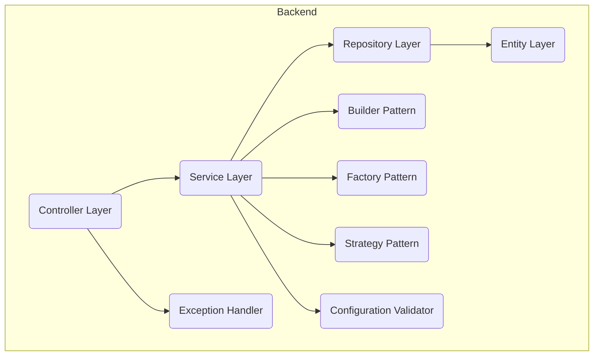
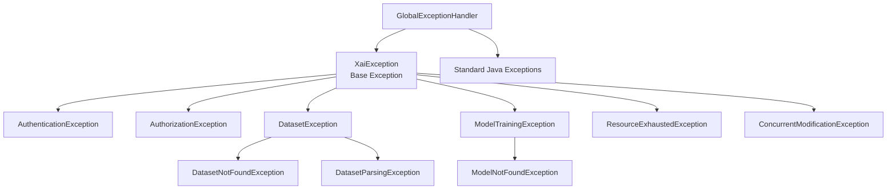

# Architecture Overview

> 📘 **Source**: This wiki page contains complete information from [docs/ARCHITECTURE.md](https://github.com/Mukaan17/xai-forge/blob/main/docs/ARCHITECTURE.md)

**Navigation**: [[Home]] > [[Developer Documentation]] > Architecture

## Table of Contents

1. [High-Level Architecture](#high-level-architecture)
2. [Low-Level Backend Architecture](#low-level-backend-architecture)
3. [Package Structure & Component Count](#package-structure--component-count)
4. [Data Flow: Prediction & Explanation](#data-flow-prediction--explanation)
5. [Exception Handling Architecture](#exception-handling-architecture)
6. [Technology Decisions](#technology-decisions)

---

## High-Level Architecture

The system follows a classic **three-tier architecture**, which separates the presentation, logic, and data layers. This is a robust and scalable pattern for modern web applications.

### High-Level Diagram

```mermaid
graph TD
    A[User Browser <br> (React SPA)] <-->|1. HTTP/S REST API| B(Backend Server <br> (Spring Boot App))
    B -->|2. JDBC| C(PostgreSQL DB <br> (Metadata))
    B -->|3. File I/O| D(File System <br> (CSVs & Models))
```

### Component Breakdown

#### 1. Client (React Single-Page Application)
- **Role**: Provides the entire user experience. It's responsible for all rendering, user interaction, and state management.
- **Communication**: Interacts exclusively with the Backend Server via a stateless REST API using JSON. A JWT is sent in the `Authorization` header of each request.

#### 2. Backend Server (Spring Boot Application)
- **Role**: The core of the application. It handles all business logic, security, and data processing.
- **Responsibilities**: Exposes REST endpoints, manages security, contains all business logic, and coordinates data between the database and file system.

#### 3. Data Persistence Layer
- **PostgreSQL Database**: Stores structured metadata like user accounts, dataset info, and model configurations.
- **File System**: Stores large, unstructured binary data: the uploaded CSV files and the serialized machine learning models.

---

## Low-Level Backend Architecture

Internally, the backend is structured using a standard **layered architecture** with advanced design patterns to promote separation of concerns, testability, and maintainability.

### Backend Architecture Diagram



### Core Layers

#### Controller Layer (`@RestController`)
The entry point for all API requests. Handles HTTP protocol, validates DTOs, and calls the appropriate service. Contains no business logic.

#### Service Layer (`@Service`)
Contains the core application logic. Orchestrates model training, prediction, and explanation generation by coordinating data from repositories and external libraries like Tribuo.

#### Repository Layer (`@Repository`)
An abstraction over the database provided by Spring Data JPA. Provides CRUD functionality for entities.

#### Entity Layer (`@Entity`)
Plain Java Objects (POJOs) that map directly to tables in the PostgreSQL database.

### Advanced Components

#### Builder Pattern
Fluent object creation for complex DTOs (PredictionResponseBuilder, TrainRequestBuilder)

#### Factory Pattern
Algorithm selection and model creation (AlgorithmFactory, ModelFactory)

#### Strategy Pattern
Training algorithm implementations (ClassificationStrategy, RegressionStrategy)

#### Exception Handler
Global error handling with 11 custom exceptions

#### Configuration Validator
Startup validation for critical parameters

---

## Package Structure & Component Count

The backend consists of **47 Java source files** organized into the following packages:

```
com.example.xaiapp/
├── builder/           # Builder Pattern (2 files)
│   ├── PredictionResponseBuilder.java
│   └── TrainRequestBuilder.java
├── config/           # Configuration (5 files)
│   ├── AsyncConfig.java
│   ├── ConfigurationValidator.java
│   ├── MLTrainingConfig.java
│   ├── SecurityConfig.java
│   └── XaiConfig.java
├── controller/       # REST Controllers (3 files)
│   ├── AuthController.java
│   ├── DatasetController.java
│   └── ModelController.java
├── dto/             # Data Transfer Objects (8 files)
│   ├── ApiResponse.java
│   ├── DatasetDto.java
│   ├── ExplanationResponse.java
│   ├── JwtAuthResponse.java
│   ├── LoginRequest.java
│   ├── PredictionResponse.java
│   ├── TrainRequestDto.java
│   └── UserDto.java
├── entity/          # JPA Entities (3 files)
│   ├── Dataset.java
│   ├── MLModel.java
│   └── User.java
├── exception/       # Exception Hierarchy (11 files)
│   ├── AuthenticationException.java
│   ├── AuthorizationException.java
│   ├── ConcurrentModificationException.java
│   ├── DatasetException.java
│   ├── DatasetNotFoundException.java
│   ├── DatasetParsingException.java
│   ├── GlobalExceptionHandler.java
│   ├── ModelNotFoundException.java
│   ├── ModelTrainingException.java
│   ├── ResourceExhaustedException.java
│   └── XaiException.java
├── factory/         # Factory Pattern (2 files)
│   ├── AlgorithmFactory.java
│   └── ModelFactory.java
├── repository/      # Data Repositories (3 files)
│   ├── DatasetRepository.java
│   ├── MLModelRepository.java
│   └── UserRepository.java
├── security/        # Security Components (3 files)
│   ├── JwtAuthenticationFilter.java
│   ├── JwtTokenProvider.java
│   └── UserDetailsServiceImpl.java
├── service/         # Business Logic (3 files)
│   ├── DatasetService.java
│   ├── ModelService.java
│   └── XaiService.java
├── strategy/        # Strategy Pattern (3 files)
│   ├── ClassificationStrategy.java
│   ├── RegressionStrategy.java
│   └── TrainingStrategy.java
└── XaiApplication.java  # Main Application Class
```

---

## Data Flow: Prediction & Explanation

This sequence diagram illustrates the interactions for the system's most critical feature, including the new Builder pattern usage.

```mermaid
sequenceDiagram
    participant Client as React App
    participant ModelController as Controller
    participant XaiService as Service
    participant Builder as PredictionResponseBuilder
    participant MLModelRepository as Repository
    participant FileSystem as File System
    participant Tribuo as Tribuo ML Engine

    Client->>+ModelController: POST /api/models/{id}/explain (with input data & JWT)
    ModelController->>+XaiService: explain(modelId, inputData)
    XaiService->>+MLModelRepository: findById(modelId)
    MLModelRepository-->>-XaiService: Return MLModel entity (with modelFilePath)
    XaiService->>+FileSystem: Read serialized model from modelFilePath
    FileSystem-->>-XaiService: Return model byte stream
    XaiService->>+Tribuo: Deserialize model object
    XaiService->>+Tribuo: Create LIME explainer with model
    XaiService->>+Tribuo: generateExplanation(inputData)
    Tribuo-->>-XaiService: Return Explanation object
    XaiService->>+Builder: Create PredictionResponseBuilder
    Builder-->>-XaiService: Return built PredictionResponse
    XaiService-->>-ModelController: Return ExplanationResponse DTO
    ModelController-->>-Client: 200 OK (with JSON payload)
```

### Detailed Flow Explanation

1. **Client Request**: React app sends prediction request with input data and JWT token
2. **Controller Processing**: ModelController validates request and extracts authentication
3. **Service Layer**: XaiService orchestrates the explanation generation process
4. **Data Retrieval**: Repository fetches model metadata from database
5. **Model Loading**: Service reads serialized model from file system
6. **ML Processing**: Tribuo deserializes model and generates LIME explanation
7. **Response Building**: Builder pattern creates structured response
8. **Client Response**: Controller returns JSON response to frontend

---

## Exception Handling Architecture

The system implements a comprehensive exception hierarchy with 11 custom exceptions:



### Exception Categories

#### Authentication & Authorization
- **AuthenticationException**: Invalid credentials or expired tokens
- **AuthorizationException**: Insufficient permissions for requested action

#### Data Management
- **DatasetException**: Base class for dataset-related errors
- **DatasetNotFoundException**: Requested dataset doesn't exist
- **DatasetParsingException**: CSV parsing or validation errors

#### Model Operations
- **ModelTrainingException**: Errors during model training
- **ModelNotFoundException**: Requested model doesn't exist

#### System Resources
- **ResourceExhaustedException**: System resource limits exceeded
- **ConcurrentModificationException**: Concurrent access conflicts

### Global Exception Handler

The GlobalExceptionHandler provides centralized error processing:

```java
@RestControllerAdvice
public class GlobalExceptionHandler {
    
    @ExceptionHandler(DatasetNotFoundException.class)
    public ResponseEntity<ErrorDetails> handleDatasetNotFound(DatasetNotFoundException ex) {
        ErrorDetails error = new ErrorDetails("DATASET_NOT_FOUND", ex.getMessage());
        return ResponseEntity.status(HttpStatus.NOT_FOUND).body(error);
    }
    
    // Additional exception handlers...
}
```

---

## Technology Decisions

### Backend Technology Stack

#### Spring Boot 3
- **Rationale**: Modern Java framework with auto-configuration
- **Benefits**: Rapid development, embedded server, production-ready features
- **Version**: 3.2+ for latest features and security updates

#### Spring Security with JWT
- **Rationale**: Stateless authentication for scalability
- **Benefits**: No server-side session storage, scalable across multiple servers
- **Implementation**: JWT tokens with 24-hour expiration

#### PostgreSQL
- **Rationale**: Robust, ACID-compliant relational database
- **Benefits**: Excellent performance, JSON support, strong consistency
- **Version**: 14+ for advanced features

#### Tribuo ML Library
- **Rationale**: Oracle's production-ready ML library for Java
- **Benefits**: Native Java integration, comprehensive algorithms, active development
- **Version**: 4.3.2 for stability and features

### Frontend Technology Stack

#### React 18
- **Rationale**: Modern, component-based UI framework
- **Benefits**: Virtual DOM, component reusability, large ecosystem
- **Features**: Hooks, concurrent rendering, Suspense

#### Material-UI (MUI)
- **Rationale**: Professional, accessible UI component library
- **Benefits**: Consistent design, accessibility features, theming support
- **Integration**: Seamless React integration

#### Chart.js
- **Rationale**: Powerful, flexible charting library
- **Benefits**: Interactive charts, multiple chart types, responsive design
- **Usage**: Explanation visualizations, data analysis charts

### Design Patterns

#### Builder Pattern
- **Usage**: Complex DTO creation (PredictionResponseBuilder, TrainRequestBuilder)
- **Benefits**: Fluent API, validation, immutable objects

#### Factory Pattern
- **Usage**: ML algorithm selection (AlgorithmFactory, ModelFactory)
- **Benefits**: Extensible algorithm support, centralized creation logic

#### Strategy Pattern
- **Usage**: Training algorithm implementations
- **Benefits**: Easy algorithm addition, runtime algorithm selection

---

## System Design Principles

### Separation of Concerns
- **Presentation**: React components handle UI and user interaction
- **Business Logic**: Spring services contain application logic
- **Data Access**: JPA repositories handle database operations
- **Security**: Dedicated security layer manages authentication/authorization

### Scalability Considerations
- **Stateless Design**: JWT authentication enables horizontal scaling
- **Async Processing**: Thread pools for ML operations prevent blocking
- **Connection Pooling**: HikariCP for efficient database connections
- **File Storage**: Organized directory structure for file management

### Security Architecture
- **Authentication**: JWT-based stateless authentication
- **Authorization**: Method-level security with Spring Security
- **Data Isolation**: User-specific data access controls
- **Input Validation**: Comprehensive DTO validation
- **Configuration Security**: Environment variable validation

### Performance Optimizations
- **Lazy Loading**: JPA entities use lazy loading for relationships
- **Caching**: Model caching for frequently accessed predictions
- **Async Operations**: Non-blocking ML training and prediction
- **Connection Pooling**: Optimized database connection management

---

**Next**: [[API Reference|API-Reference]] | **Previous**: [[FAQ]]  
**Related**: [[Advanced Concepts|Advanced-Concepts]], [[Design Patterns|Design-Patterns]], [[Technology Stack|Technology-Stack]]
